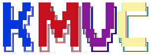

# **KMVC FRAMEWORK** 

### KMVC framework 2021

> - Tác Giả: Trần Thanh Khan.
> - Github : https://github.com/thanhKhanAGU/KMVC
> - Đại học: Đại học An Giang.
> - Lớp    : DH19TH2
# *Bảng Lệnh trong KMVC Framework*
> Cấu trúc lệnh comment line: `php kmvc` <Tên Lệnh> <Thông Tin>

|Tên Lệnh              |Thông tin     | Mô tả                                                   |
|----------------------|--------------|---------------------------------------------------------|
| **-all**             |`<Tên Obj>`   |- *Tạo một đối tượng cho toàn bộ Project*.               |
| **-mvc**             |`<Tên MVC>`   |- *Tạo ra một cấu trúc MVC.*                             |
| **-model**           |`<Tên Model>` |- *Tạo ra một class Model.*                              |
| **-view**            |`<Tên View>`  |- *Tạo ra một view ở pages.*                             |
| **-view-admin**      |`<Tên View>`  |- *Tạo ra một cấu trúc view ở Admin và Pages.*           |
| **-controller**      |`<Tên Ctrl>`  |- *Tạo ra một class Controller.*                         |
| **-controller-route**|`<Tên Ctrl>`  |- *Tạo ra một class Controller và Các Route tương ứng.*  |
| **-table**           |`<Tên bảng>`  |- *Tạo một bảng trong kịch bản của CSDL.*                |
| **-add-data**        |`<Tên data>`  |- *Thêm dữ liệu vào trong CSDL.*                         |
| **-reset-db**        |              |- *Xóa toàn bộ CSDL.*                                    |
| **-execute-db**      |              |- *Thực thi kịch bản để tạo ra CSDL.*                    |
>## Mô HÌNH MVC

>MVC là viết tắt của cụm từ `“Model-View-Controller“`. MVC là một mẫu kiến trúc phần mềm để tạo lập giao diện người dùng trên máy tính. MVC chia thành ba phần được kết nối với nhau. Chúng bao gồm Model (dữ liệu), View (giao diện) và Controller (bộ điều khiển).

